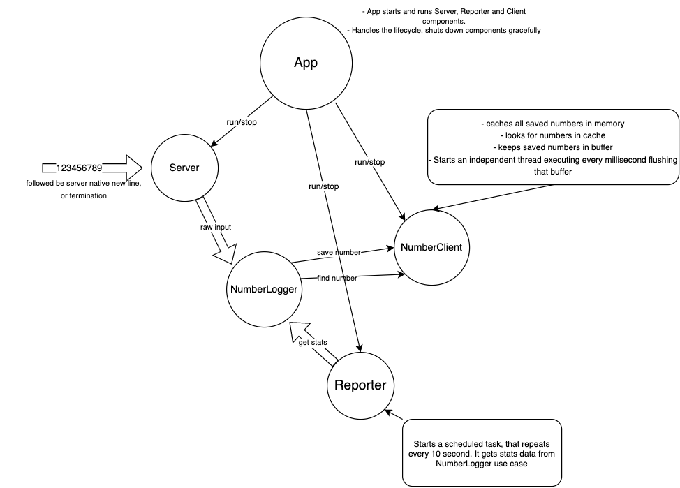

# Number Logger

☝ App Design Overview - *"A picture speaks a thousand words"* xD 

Run the app with -> ``./gradlew run``

## Requirements
* Java 11

## Notes

* Numbers get buffered and then a thread writes them to a file every millisecond. By doing this the amount of numbers handled ascend to 3,300.000M in my tests. The tradeoff here being that you could lose data in that millisecond but assuming is bearable due to the nature of the requirements.
* JVM max memory was increased to 2g for caching numbers in memory. Done through gradle properties.
* Numbers log file is created under [main resources dir](./src/main/resources)
* All the app is configurable as you can see in the [main function](./src/main/kotlin/com/numberlogger/App.kt?plain=1), just didn't invest time parsing arguments coming from CLI.
